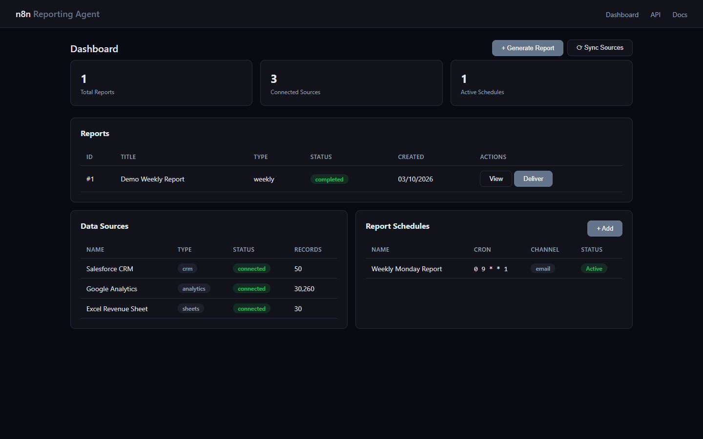
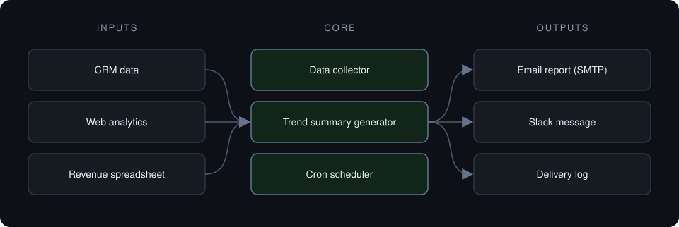

# n8n Reporting Agent

**Collects CRM, analytics and revenue data on a schedule, summarizes trends and delivers formatted reports by email or Slack.**

> **This is a proprietary project. Source code is private. This page showcases the system's architecture and results.**

**Case study page:** [https://jryahia.github.io/showcase-n8n-reporting-agent/](https://jryahia.github.io/showcase-n8n-reporting-agent/)

## Problem it solves

Weekly reporting usually means someone copying numbers from several tools into a document. This agent collects the data, writes the summary and delivers it on a cron schedule.

## Architecture

1. Sources are synced on demand or on a schedule.
2. A report is generated with trend summaries for the period.
3. The report is delivered by email or Slack.
4. Each delivery attempt is logged.

## Key features

- On-demand and scheduled reports
- Multi-source data collection
- Email and Slack delivery with logs
- Cron schedules managed via API
- Report history

## Tech stack

     

## What it does in practice

- Turns a recurring manual reporting task into a scheduled job.

## Screenshots

**Reports, data sources and schedules**

---

Built by [Yahya Jarray](https://github.com/jryahia). Interested in a similar system? [Get in touch](mailto:yahiajarray43@gmail.com).
